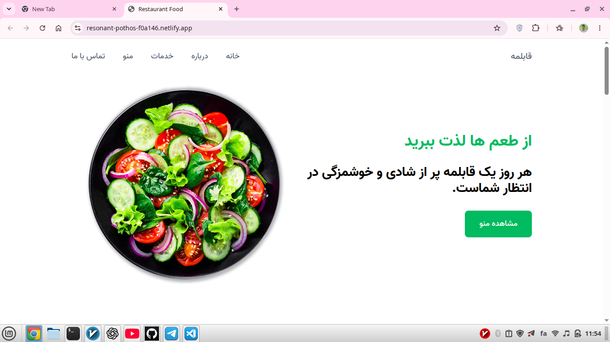
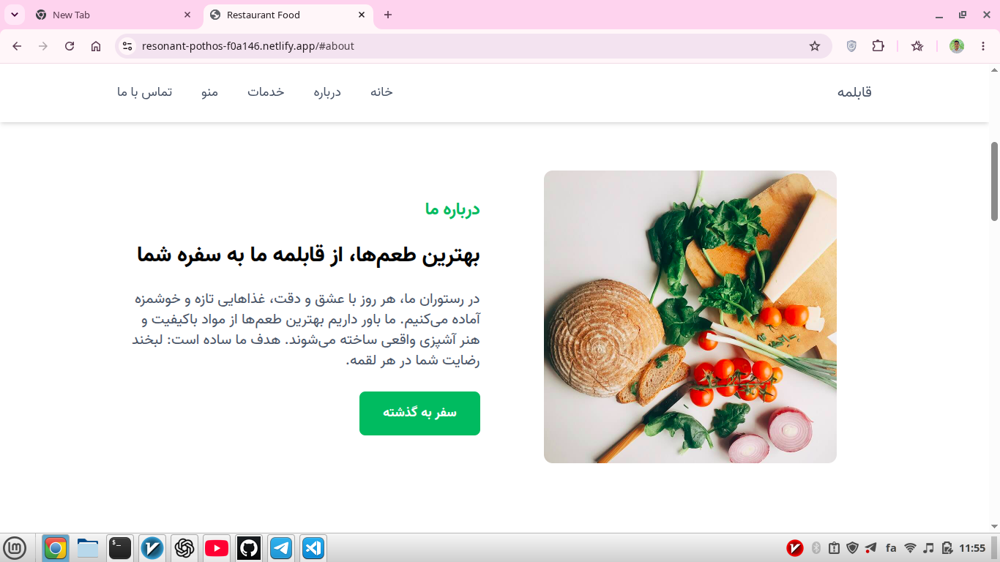
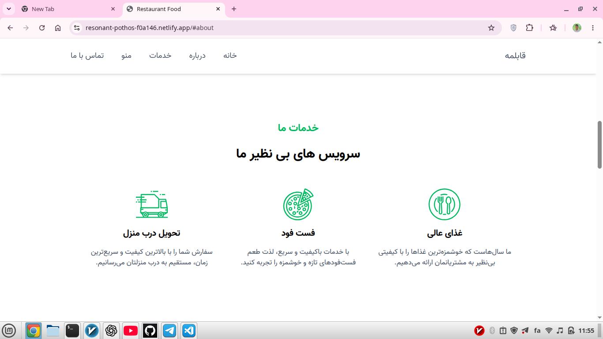

### Restaurant Food Website:
A modern and fully responsive restaurant landing page built with HTML, Tailwind CSS, and JavaScript.

### Features:
Fully Responsive Design (Mobile, Tablet, Desktop) Smooth Scrolling Navigation Mobile Navigation Menu Scroll Reveal Animations using Intersection Observer Sticky Navbar with Shadow Effect Modern and Clean UI Reusable and Organized Code Structure

### Technologies Used :
HTML5 Tailwind CSS JavaScript (ES6+) Font Awesome

### Live Demo:
🔗 https://resonant-pothos-f0a146.netlify.app/

### Screenshots:
### Home Page

### About Section:

### Services Section:

### Project Overview:
This project was built to practice responsive web design and improve my frontend development skills. The focus was on creating a modern restaurant website with smooth user interactions, mobile navigation, and scroll animations.

### Challenges:
Building a responsive layout for different screen sizes. Creating a smooth mobile navigation menu. Implementing scroll animations with Intersection Observer. Organizing the project structure and reusable components.

### What I Learned:
Building responsive layouts with Tailwind CSS. Working with DOM manipulation and events. Using Intersection Observer API for animations. Writing clean and maintainable JavaScript code.
